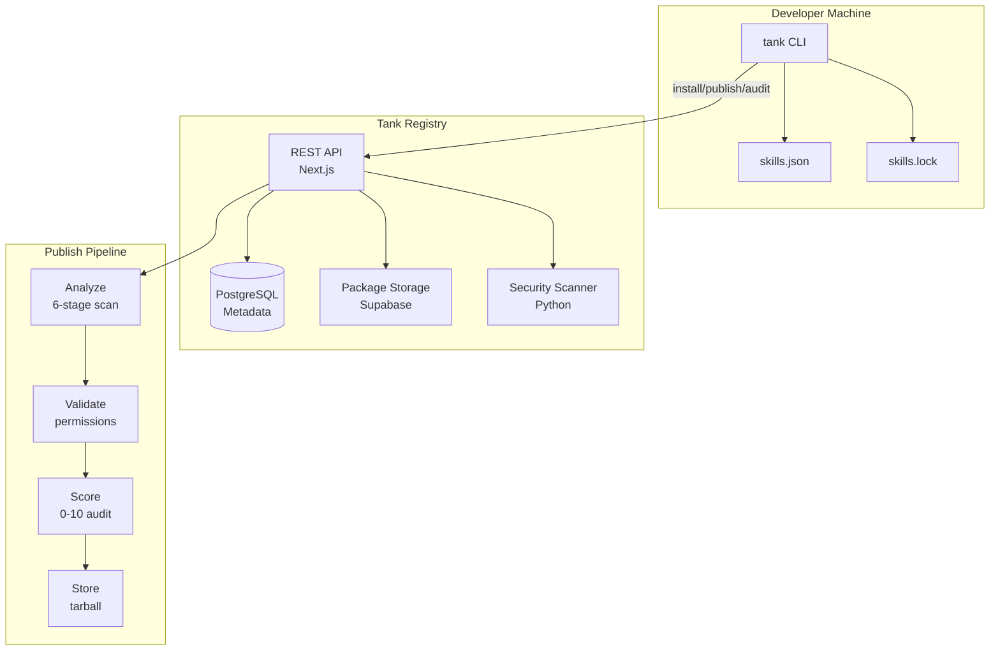
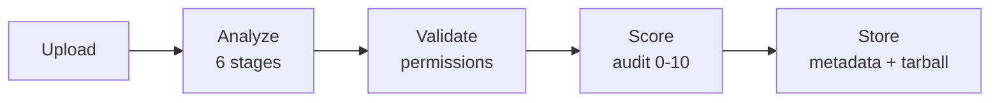

Tank is a security-first package manager and registry for AI agent skills, built as a monorepo with TypeScript and Python components.

## System Overview



## Core Components

### CLI (`apps/cli`)

The `tank` command-line tool developers interact with.

**Technology:** TypeScript, Node.js 24+, Commander.js

**Responsibilities:**
- Parse and validate `skills.json` manifests
- Generate and verify `skills.lock` with SHA-512 integrity hashes
- Resolve dependency trees using semver
- Communicate with the registry API
- Verify package integrity locally
- Display audit information and permission summaries

**Key Features:**
- 16 commands (install, publish, audit, verify, etc.)
- OAuth authentication flow (browser → poll → API key)
- Tarball packer with security filters (reject symlinks, path traversal)
- Lockfile generation with deterministic JSON serialization

### Registry API (`apps/web`)

The Next.js 15 application serving as the skill registry.

**Technology:** Next.js 15 App Router, Drizzle ORM, PostgreSQL

**Responsibilities:**
- Accept and validate skill publishes
- Run the publish pipeline (analyze, validate, score)
- Serve skill metadata and packages
- Maintain audit history
- Handle search queries with full-text search
- Provide web UI for browsing and management

**API Endpoints:**
- `/api/v1/skills` — Publish, search, download
- `/api/v1/cli-auth` — OAuth flow for CLI
- `/api/admin` — Admin moderation and management

**Database:**
- **Dual schema**: `schema.ts` (domain tables) + `auth-schema.ts` (better-auth auto-generated)
- **Drizzle ORM** — type-safe queries, no raw SQL
- **Full-text search** — GIN index on skills table with trigram similarity

### Security Scanner (`python-api`)

The 6-stage Python pipeline for static analysis.

**Technology:** Python 3.14+, FastAPI, Pydantic 2

**Stages:**
1. **Stage 0 (Ingest)** — Hash computation, file inventory
2. **Stage 1 (Structure)** — Package structure validation
3. **Stage 2 (Static)** — AST analysis, regex patterns, permission cross-checking
4. **Stage 3 (Injection)** — Prompt injection detection
5. **Stage 4 (Secrets)** — Credential and secret scanning
6. **Stage 5 (Supply Chain)** — Dependency vulnerability checking via OSV API

**Verdict Rules:**
- 1+ critical findings → FAIL
- 4+ high findings → FAIL
- 1-3 high findings → FLAGGED
- Medium/low findings → PASS_WITH_NOTES

### Shared Package (`packages/shared`)

Shared Zod schemas, TypeScript types, and constants.

**Exports:**
- `skillsJsonSchema` — Manifest validation
- `skillsLockSchema` — Lockfile validation
- `permissionsSchema` — Permission model
- `REGISTRY_URL` — API base URL constant
- Semver resolver utilities

**Anti-patterns:**
- Never add side-effect dependencies
- Never mutate exported constants

## Technology Stack

### Frontend
- **Next.js 15** — App Router with Server Components
- **Tailwind CSS v4** — Styling via `@tailwindcss/postcss`
- **shadcn/ui** — Base UI components
- **better-auth** — Authentication (GitHub OAuth + OIDC SSO)

### Backend
- **PostgreSQL 17** — Primary database
- **Drizzle ORM** — Type-safe queries
- **Supabase Storage** — Tarball storage (or on-prem alternative)
- **Resend** — Email service (optional)
- **Redis** — Caching layer (optional)

### Tooling
- **pnpm 10.29.3** — Package manager (enforced via `packageManager` field)
- **Turbo** — Monorepo orchestration
- **Vitest** — TypeScript testing
- **pytest** — Python testing
- **react-doctor** — React linting (60+ rules)

## Permission System

The permission model is Tank's core security innovation.

### Three Layers

1. **Skill declaration** — Each skill declares required permissions in its manifest
2. **Project budget** — Each project declares allowed permissions in `skills.json`
3. **Install-time enforcement** — CLI blocks skills exceeding the project budget
4. **Scan-time cross-check** — Scanner extracts permissions from code and flags mismatches
5. **Runtime enforcement** (planned, Phase 3) — Sandbox blocks undeclared operations

### Permission Types

```json
{
  "permissions": {
    "network": {
      "outbound": ["*.anthropic.com", "api.openai.com"]
    },
    "filesystem": {
      "read": ["./src/**"],
      "write": ["./output/**"]
    },
    "subprocess": false,
    "secrets": ["OPENAI_API_KEY"]
  }
}
```

**Supported permissions:**
- `network:outbound` — Make HTTP/HTTPS requests (with domain patterns)
- `network:inbound` — Listen on ports
- `filesystem:read` — Read files (with glob patterns)
- `filesystem:write` — Write files (with glob patterns)
- `subprocess` — Spawn child processes
- `secrets` — Access environment variables

## Publish Pipeline

Every skill goes through a multi-stage validation pipeline before entering the registry:



### Audit Score (0-10)

Always 8 weighted checks:

1. **SKILL.md present** (1 pt) — Manifest name non-empty
2. **Description present** (1 pt) — Manifest description non-empty
3. **Permissions declared** (1 pt) — Permissions object not empty
4. **No security issues** (2 pts) — No findings from security scan
5. **Permission extraction match** (2 pts) — Extracted permissions ⊆ declared
6. **File count reasonable** (1 pt) — Fewer than 100 files
7. **README documentation** (1 pt) — README field non-empty
8. **Package size reasonable** (1 pt) — Tarball under 5 MB

## Data Model

### Core Tables

```sql
skills
├── id (uuid)
├── name (string, unique, scoped: @org/name)
├── description (text)
├── search_vector (tsvector, GIN indexed)
├── publisher_id (fk → users)
├── created_at
└── updated_at

skill_versions
├── id (uuid)
├── skill_id (fk → skills)
├── version (semver string)
├── integrity_hash (sha512)
├── permissions (jsonb)
├── dependencies (jsonb)
├── audit_score (integer, 0-10)
├── package_url (string, Supabase reference)
├── published_at
└── analysis_results (jsonb)

audit_logs
├── id (uuid)
├── user_id (fk → users)
├── action (string)
├── resource_type (string)
├── resource_id (string)
├── details (jsonb)
└── created_at
```

## Key Design Decisions

### Why Supabase for Storage?

- **OCI-compatible** — Standard artifact storage pattern
- **Content-addressable** — Integrity built in via SHA-512
- **Easy replication** — Built-in CDN and edge caching
- **On-prem abstraction** — Provider interface supports self-hosted alternatives

### Why 6-Stage Python Pipeline?

Custom analysis pipeline designed specifically for AI agent skills:

- **Stage-based isolation** — Each stage can fail independently
- **Deterministic output** — Reproducible analysis results
- **SARIF output** — Standard vulnerability report format
- **Incremental analysis** — Cache results per stage

### Why Lockfile?

Same reasons as `package-lock.json`:

- **Deterministic installs** — Same dependencies every time
- **SHA-512 verification** — Detect tampering
- **Version resolution** — Record resolved dependency tree
- **Diffability** — JSON with sorted keys for clean git diffs

### Why Next.js for Registry?

- **Unified codebase** — Web UI + API in one app
- **Server Components** — Fast, SEO-friendly skill browsing
- **Route Handlers** — Clean REST API with TypeScript
- **Vercel deployment** — Zero-config production hosting

## Performance

Tank enforces performance budgets via non-cached regression testing:

- **API routes** — p95 latency targets (e.g., `/api/v1/skills` < 100ms)
- **Web routes** — TTFB and FCP budgets
- **CI gates** — Merges blocked if performance regresses

See [Performance Testing](https://github.com/tankpkg/tank/blob/main/docs/performance-testing.md) for methodology.

## Security Measures

1. **Install-time verification** — SHA-512 hash checking
2. **Permission enforcement** — Budget validation before install
3. **Static analysis** — 6-stage security scanning
4. **Audit logging** — All admin actions tracked
5. **Role-based access** — Admin middleware for moderation
6. **Code signing** (planned) — Sigstore integration in Phase 2
7. **Runtime sandbox** (planned) — WASM isolation in Phase 3

## Next Steps

<CardGroup cols={2}>
  <Card title="Setup" icon="wrench" href="/development/setup">
    Set up Tank for local development
  </Card>
  <Card title="Contributing" icon="code-pull-request" href="/development/contributing">
    Learn how to contribute
  </Card>
  <Card title="Testing" icon="flask" href="/development/testing">
    Run and write tests
  </Card>
</CardGroup>
